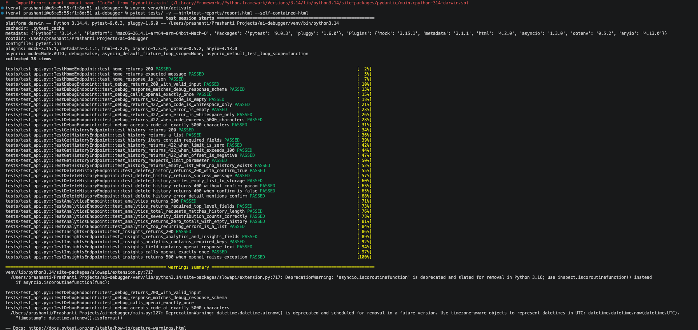
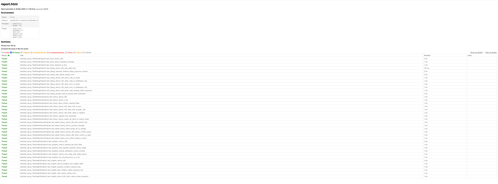
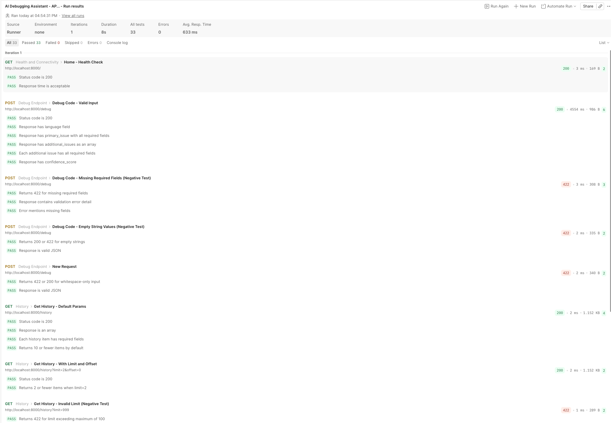

# AI Debugging Assistant for Legacy Codebases

🚀 AI-powered backend system that analyzes code errors, detects recurring issues using fingerprinting, and provides system-level debugging insights.

👉 Designed to simulate real-world debugging workflows in messy legacy systems.

---

## 💡 Why this project stands out

* Goes beyond simple error analysis — tracks recurring failures
* Uses fingerprinting to detect identical issues across requests
* Adds context-aware debugging using past history
* Provides analytics and AI-generated insights for engineering teams
* Simulates real-world legacy system debugging challenges

---

## 🚀 Features

* Debug API for code + error analysis
* Structured AI responses (root cause, fix, severity)
* Error fingerprinting for recurring issue detection
* Context-aware debugging using historical data
* Analytics endpoint for debugging trends
* AI-generated insights on system-level issues

---

## 🧪 Example

### Input

```json
{
  "code": "print(x)",
  "error": "NameError: name 'x' is not defined"
}
```

### Output (simplified)

```json
{
  "language": "Python",
  "primary_issue": {
    "error_explanation": "Variable 'x' is used before definition",
    "root_cause": "'x' was never initialized",
    "fix": "Define x before using it",
    "severity": "high"
  }
}
```

---

## 🧠 Architecture

* FastAPI backend
* OpenAI API for structured debugging analysis
* Error fingerprinting for recurring issue detection
* History-based context enrichment
* Analytics + AI-powered insights layer

---

## 🔄 How it works

1. User submits code + error
2. System generates error fingerprint
3. Retrieves relevant past debugging history
4. Builds structured prompt for AI
5. Returns structured debugging response
6. Stores result for future context and analytics

---

## 🛠 Tech Stack

* **Backend:** FastAPI (Python)
* **AI Layer:** OpenAI API (structured debugging analysis)
* **Data Storage:** JSON-based history (context + analytics)
* **Core Logic:** Error fingerprinting, context enrichment, prompt engineering

---

## 📡 API Endpoints

### 🔹 GET /

Health check — confirms the service is running

### 🔹 POST /debug

Analyze code + error and return structured debugging insights

### 🔹 GET /history

Retrieve past debugging results with pagination support (`limit`, `offset`)

### 🔹 DELETE /history

Clear debugging history - requires `?confirm=true` as a safety guard against accidental deletion

### 🔹 GET /analytics

View error trends, severity distribution, and recurring issues

### 🔹 GET /insights

Get AI-generated system-level debugging insights

---

## ▶️ Run Locally

```bash
# Clone the repository
git clone https://github.com/prashantibhatt04/ai-debugging-assistant.git

cd ai-debugging-assistant

# Create virtual environment
python3 -m venv venv
source venv/bin/activate

# Install dependencies
pip install -r requirements.txt

# Run the server
uvicorn main:app --reload
```

Then open: http://127.0.0.1:8000/docs

---

## 🧪 Test Suite

This project includes two layers of API testing - automated code-based tests with Pytest, and a no-code Postman collection - covering all endpoints with positive, negative, and edge case scenarios.

---

### ✅ Automated Tests (Pytest + HTTPX)

Automated API test suite built with Pytest and HTTPX, covering all endpoints with OpenAI responses mocked for fast, cost-free test runs.

**Run the tests:**

```bash
pip install pytest httpx pytest-asyncio pytest-mock pytest-dotenv
pytest tests/ -v
```

**Results:**





---

### 📬 Manual & Exploratory Tests (Postman)

A Postman collection covering all 6 endpoints with 11 requests and 31 test assertions.

**Import the collection:**

1. Open Postman
2. Click **Import**
3. Select `postman/AI_Debugging_Assistant.postman_collection.json`
4. Set the `baseUrl` collection variable to `http://localhost:8000`
5. Click **Run collection** to execute all tests

**What's covered:**

| Folder | Requests | What's tested |
|---|---|---|
| Health & Connectivity | 1 | App is live, response time |
| Debug Endpoint | 3 | Valid input, missing fields, empty strings |
| History | 4 | Pagination, limit validation, delete safety guard |
| Analytics & Insights | 2 | Response structure, AI endpoint tolerance |

**Key findings from test run:**

- `DELETE /history` without confirm flag correctly returned 400 - the app has a built-in safety guard against accidental data deletion
- `GET /insights` exceeded the initial 2000ms threshold - expected behaviour for an AI-powered endpoint making external API calls; threshold adjusted to 10000ms

**Test run results:**



---

## 🔑 Setup

Create a `.env` file in the root directory:

```
OPENAI_API_KEY=your_api_key_here
```

---

## 📈 Future Improvements

* Error clustering and similarity matching
* Database integration (instead of JSON storage)
* Frontend dashboard for visualization
* Advanced error categorization

---

## 👩‍💻 Author

Built as part of a transition into QA and AI-focused backend engineering, combining real-world debugging experience with modern AI capabilities and test automation practices.
